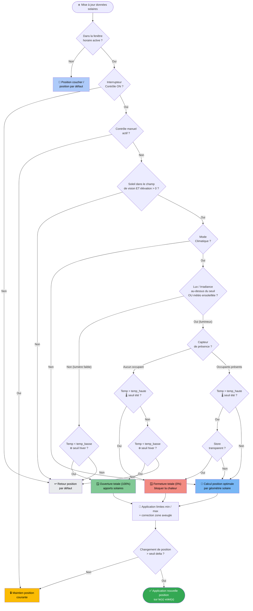
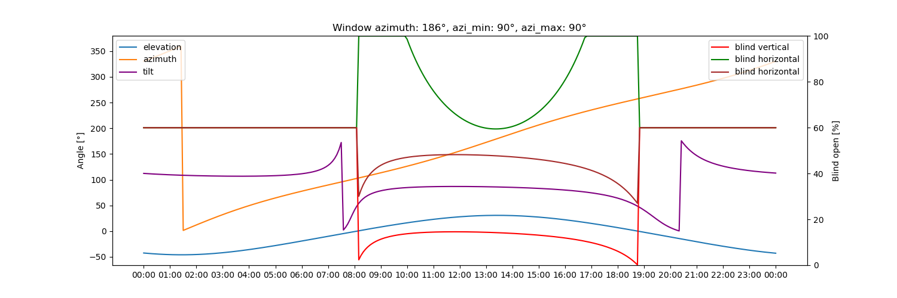

# Adaptive Cover — Documentation française

🇬🇧 [English documentation](README.md)

Cette intégration personnalisée positionne automatiquement vos volets (stores, banne, jalousie) en fonction de la position du soleil par rapport à chaque fenêtre. Elle calcule la position optimale pour bloquer le rayonnement direct tout en conservant la luminosité ambiante, et propose un mode climatique pour réagir aux conditions de température.

Basée sur le capteur template de ce fil de forum : [Automatic Blinds](https://community.home-assistant.io/t/automatic-blinds-sunscreen-control-based-on-sun-platform/)

- [Adaptive Cover](#adaptive-cover--documentation-française)
  - [Fonctionnalités](#fonctionnalités)
  - [Installation](#installation)
    - [HACS (recommandé)](#hacs-recommandé)
    - [Manuelle](#manuelle)
  - [Configuration initiale](#configuration-initiale)
  - [Types de volets](#types-de-volets)
  - [Modes de fonctionnement](#modes-de-fonctionnement)
    - [Mode basique](#mode-basique)
    - [Mode climatique](#mode-climatique)
      - [Stratégies climatiques](#stratégies-climatiques)
  - [Paramètres](#paramètres)
    - [Communs](#communs)
    - [Vertical](#vertical)
    - [Horizontal](#horizontal)
    - [Jalousie (tilt)](#jalousie-tilt)
    - [Automatisation](#automatisation)
    - [Climatique](#climatique)
    - [Zone aveugle](#zone-aveugle)
  - [Entités](#entités)
  - [Fonctionnalités planifiées](#fonctionnalités-planifiées)
    - [Simulation](#simulation)

## Fonctionnalités

- Appareils distincts pour les volets `vertical`, `horizontal` et `jalousie`
- Deux modes avec stratégies multiples : [Modes (`basique`, `climatique`)](#modes-de-fonctionnement)
- Capteur binaire indiquant quand le soleil est face à la fenêtre
- Capteurs d'heure de début et de fin d'ensoleillement
- Détection automatique du contrôle manuel

- **Mode Climatique**

  - Fonctionnement basé sur les conditions météo
  - Fonctionnement basé sur la présence
  - Interrupteur pour activer/désactiver le mode climatique
  - Capteur indiquant la stratégie active (`hiver`, `intermédiaire`, `été`)
  - Capteur de diagnostic exposant toutes les valeurs intermédiaires de décision

- **Contrôle adaptatif**

  - Activation/désactivation du contrôle
  - Contrôle de plusieurs volets simultanément
  - Heure de début pour éviter d'ouvrir les volets pendant le sommeil
  - Intervalle minimum entre deux changements de position
  - Delta minimum de position pour déclencher un changement

## Installation

### HACS (recommandé)

Ajouter `https://github.com/kamahat/adaptive-cover` comme dépôt personnalisé dans HACS.
Rechercher et télécharger *Adaptive Cover* dans HACS.

Redémarrer Home Assistant et ajouter l'intégration.

### Manuelle

Télécharger le dossier `adaptive_cover` depuis ce dépôt GitHub.
Le copier dans `config/custom_components/`.

Redémarrer Home Assistant et ajouter l'intégration.

## Configuration initiale

Adaptive Cover prend en charge trois types de volets : `Vertical`, `Horizontal` et `Jalousie (Vénitien)`.
Chaque type possède ses propres paramètres. Pour configurer un capteur, il faut d'abord déterminer l'azimut de la fenêtre via [Open Street Map Compass](https://osmcompass.com/).

## Types de volets

|              | Vertical                      | Horizontal                      | Jalousie                        |
| ------------ | ----------------------------- | ------------------------------- | ------------------------------- |
|              |  |  |  |
| **Mouvement** | Haut / Bas                   | Déploiement / Rétractation      | Inclinaison des lames           |
|              | [paramètres](#vertical)       | [paramètres](#horizontal)       | [paramètres](#jalousie-tilt)    |

## Modes de fonctionnement

Ce composant propose deux modes : un mode `basique` et un mode `climatique` (confort / économie d'énergie) qui intègre la présence et la température.

### Mode basique

Ce mode utilise la position calculée quand le soleil se trouve dans la plage d'azimut définie pour la fenêtre. Sinon, il revient à la valeur par défaut ou à la valeur après coucher selon l'heure de la journée.

### Mode climatique

Ce mode calcule la position en tenant compte de paramètres supplémentaires : présence, température intérieure, température de confort minimale, température de confort maximale et météo (optionnel).
Il se décline en deux stratégies : [Avec présence](#stratégies-climatiques) et [Sans présence](#stratégies-climatiques).

#### Stratégies climatiques

- **Sans présence** :
  L'apport de lumière naturelle n'est pas un objectif en l'absence d'occupants.

  - **En dessous de la température de confort minimale** :
    Si le soleil est au-dessus de l'horizon et que la température intérieure est sous le seuil minimal, le volet s'ouvre complètement (ou les lames s'orientent parallèlement aux rayons du soleil pour une jalousie) afin de maximiser les apports solaires passifs.

  - **Au-dessus de la température de confort maximale** :
    L'objectif est de ne pas réchauffer davantage la pièce. Tous les volets se ferment complètement pour bloquer tout rayonnement.  
    Si la température est entre les deux seuils, la position revient à la valeur par défaut selon l'heure.

- **Avec présence** (ou sans entité de présence configurée) :
  L'objectif est de réduire l'éblouissement tout en laissant entrer la lumière naturelle. Le calcul suit le modèle basique pour les volets horizontaux et verticaux.  
  Si une entité météo est configurée, les calculs s'appliquent uniquement si l'état météo correspond à un ensoleillement direct. Les états par défaut sont `sunny`, `windy`, `partlycloudy` et `cloudy`, modifiables dans les options météo. Sinon, la position revient à la valeur par défaut.  
  Pour les jalousies, l'inclinaison est ajustée à 45° quand la température dépasse le seuil maximal, ce qui est [reconnu comme optimal](https://www.mdpi.com/1996-1073/13/7/1731).

## Paramètres

### Communs

| Paramètre | Défaut | Plage | Description |
| --------- | ------ | ----- | ----------- |
| Entités | [] | | Entités `cover.*` contrôlées par l'intégration |
| Azimut de la fenêtre | 180 | 0-359 | Direction de la fenêtre (trouvable via [Open Street Map Compass](https://osmcompass.com/)) |
| Position par défaut | 60 | 0-100 | Position en l'absence d'éblouissement direct |
| Position minimale | 100 | 0-99 | Position d'ouverture minimale du volet |
| Position maximale | 100 | 1-100 | Position d'ouverture maximale du volet |
| Champ de vision gauche | 90 | 1-90 | Angle de vision non obstrué à gauche de la normale de la fenêtre (°) |
| Champ de vision droite | 90 | 1-90 | Angle de vision non obstrué à droite de la normale de la fenêtre (°) |
| Élévation minimale | Aucune | 0-90 | Élévation solaire minimale prise en compte (°) |
| Élévation maximale | Aucune | 1-90 | Élévation solaire maximale prise en compte (°) |
| Position après coucher | 0 | 0-100 | Position du volet du coucher au lever du soleil |
| Décalage coucher | 0 | | Minutes avant/après le coucher du soleil |
| Décalage lever | 0 | | Minutes avant/après le lever du soleil |
| État inversé | Faux | | Calcule l'état inversé pour les volets fermés à 100% |

### Vertical

| Paramètre | Défaut | Plage | Description |
| --------- | ------ | ----- | ----------- |
| Hauteur de fenêtre | 2,1 | 0,1-6 | Longueur du volet entièrement déployé |
| Zone d'éblouissement | 0,5 | 0,1-2 | Distance (m) depuis le bas du volet où la lumière directe pénètre encore |

### Horizontal

| Paramètre | Défaut | Plage | Description |
| --------- | ------ | ----- | ----------- |
| Hauteur de banne | 2 | 0,1-6 | Hauteur entre la zone de travail et le point de fixation de la banne |
| Longueur de banne | 2,1 | 0,3-6 | Longueur de la banne entièrement déployée |
| Angle de banne | 0 | 0-45 | Angle de la banne par rapport au mur |
| Zone d'éblouissement | 0,5 | 0,1-2 | Distance où la lumière directe atteint encore la zone |

### Jalousie (tilt)

| Paramètre | Défaut | Plage | Description |
| --------- | ------ | ----- | ----------- |
| Profondeur de lame | 3 | 0,1-15 | Largeur de chaque lame |
| Espacement des lames | 2 | 0,1-15 | Distance verticale entre deux lames en position horizontale |
| Mode tilt | Bidirectionnel | | `basic` : angle uniquement ; `enhanced` : angle + position verticale |

### Automatisation

| Paramètre | Défaut | Plage | Description |
| --------- | ------ | ----- | ----------- |
| Delta de position minimum | 1 | 1-90 | Changement de position minimal avant qu'un nouveau changement puisse intervenir |
| Delta de temps minimum | 2 | | Intervalle minimal entre deux changements de position (minutes) |
| Heure de début | `"00:00:00"` | | Heure la plus tôt pour un ajustement |
| Entité heure de début | Aucune | | Remplace `heure de début` si défini |
| Durée du contrôle manuel | `15 min` | | Durée minimale de maintien du mode manuel |
| Réinitialisation du timer manuel | Faux | | Remet le timer à zéro à chaque changement en mode manuel |
| Seuil de contrôle manuel | Aucun | 1-99 | Changement de position minimal reconnu comme manuel |
| Ignorer les états intermédiaires | Faux | | Ignorer les événements avec état `opening` ou `closing` |
| Heure de fin | `"00:00:00"` | | Heure la plus tardive pour un ajustement |
| Entité heure de fin | Aucune | | Remplace `heure de fin` si défini |
| Ajuster à l'heure de fin | `Faux` | | Forcer le retour à la position par défaut à l'heure de fin |

### Climatique

| Paramètre | Défaut | Plage | Exemple | Description |
| --------- | ------ | ----- | ------- | ----------- |
| Entité température intérieure | `Aucune` | | `climate.salon` \| `sensor.temp_interieur` | |
| Température de confort minimale | 21 | 0-86 | | Seuil hiver — en dessous, ouverture pour apports solaires |
| Température de confort maximale | 25 | 0-86 | | Seuil été — au-dessus, fermeture pour bloquer la chaleur |
| Entité température extérieure | `Aucune` | | `sensor.temp_exterieur` | |
| Seuil température extérieure | `Aucun` | | | Si la température extérieure est sous ce seuil, le mode été ne s'active pas |
| Entité de présence | `Aucune` | | | |
| Entité météo | `Aucune` | | `weather.maison` | Peut aussi servir de source de température extérieure |
| Entité lux | `Aucune` | | `sensor.lux` | Mesure d'éclairement en lux |
| Seuil lux | `1000` | | | En mode non-été : au-dessus du seuil, utilise la position optimale ; sinon, position par défaut ou ouverture totale en hiver |
| Entité irradiance | `Aucune` | | `sensor.irradiance` | Mesure d'irradiance solaire |
| Seuil irradiance | `300` | | | En mode non-été : au-dessus du seuil, utilise la position optimale ; sinon, position par défaut ou ouverture totale en hiver |

### Zone aveugle

| Paramètre | Défaut | Plage | Description |
| --------- | ------ | ----- | ----------- |
| Zone aveugle gauche | Aucune | 0-max(fov_droite, 180) | Point de départ de la zone aveugle dans le champ de vision (0 = azimut fenêtre − fov gauche) |
| Zone aveugle droite | Aucune | 1-max(fov_droite, 180) | Point de fin de la zone aveugle |
| Élévation zone aveugle | Aucune | 0-90 | Élévation solaire minimale pour que la zone aveugle s'applique |

## Entités

L'intégration crée dynamiquement plusieurs entités selon les fonctionnalités activées.

Ces entités sont toujours disponibles :

| Entité | Défaut | Description |
| ------ | ------ | ----------- |
| `sensor.{type}_cover_position_{nom}` | | Position cible calculée (%) en fonction de la position solaire, de la météo et de la température |
| `sensor.{type}_control_method_{nom}` | `intermediate` | Stratégie de contrôle active : `winter`, `summer`, `intermediate` |
| `sensor.{type}_start_sun_{nom}` | | Heure d'entrée du soleil dans le champ de vision (mise à jour toutes les 5 min) |
| `sensor.{type}_end_sun_{nom}` | | Heure de sortie du soleil du champ de vision (mise à jour toutes les 5 min) |
| `binary_sensor.{type}_manual_override_{nom}` | `off` | Indique si un contrôle manuel est actif sur l'un des volets |
| `binary_sensor.{type}_sun_infront_{nom}` | `off` | Indique si le soleil est face à la fenêtre dans le champ de vision défini |
| `switch.{type}_toggle_control_{nom}` | `on` | Active le contrôle adaptatif. Quand activé, les volets s'ajustent automatiquement sauf en cas de contrôle manuel |
| `switch.{type}_manual_override_{nom}` | `on` | Active la détection des contrôles manuels. Un volet est marqué si sa position diffère du calcul, avec retour automatique après la durée configurée |
| `button.{type}_reset_manual_override_{nom}` | | Réinitialise les marqueurs manuels pour tous les volets ; si `toggle_control` est actif, remet aussi les volets à la position calculée |

Quand le mode climatique est configuré, ces entités supplémentaires sont créées :

| Entité | Défaut | Description |
| ------ | ------ | ----------- |
| `switch.{type}_climate_mode_{nom}` | `on` | Active la stratégie climatique ; sinon, revient à la stratégie standard |
| `switch.{type}_outside_temperature_{nom}` | `off` | Utilise la température extérieure au lieu de l'intérieure pour la détection du mode été |
| `switch.{type}_lux_{nom}` | `on` | Active le seuil lux (visible uniquement si une entité lux est configurée) |
| `switch.{type}_irradiance_{nom}` | `on` | Active le seuil d'irradiance (visible uniquement si une entité irradiance est configurée) |
| `sensor.{type}_climate_debug_{nom}` | | Capteur de diagnostic exposant toutes les valeurs intermédiaires de l'arbre de décision climatique (branche active, toutes les températures, seuils, indicateurs lux/irradiance) |

L'intégration crée également une **entité volet global** par entrée de configuration :

| Entité | Description |
| ------ | ----------- |
| `cover.{nom}` | Entité agrégée contrôlant tous les volets du groupe. Open/close/set_position agit sur tous les volets et les marque comme manuels. `turn_on` réactive le contrôle adaptatif ; `turn_off` le désactive |

## Fonctionnalités planifiées

- Contrôles de dérogation manuelle

  - ~~Durée avant retour au contrôle adaptatif~~
  - ~~Bouton de réinitialisation~~
  - Attendre le prochain changement manuel / non adaptatif

- ~~Algorithme de contrôle du rayonnement et/ou de l'éclairement~~

### Simulation

