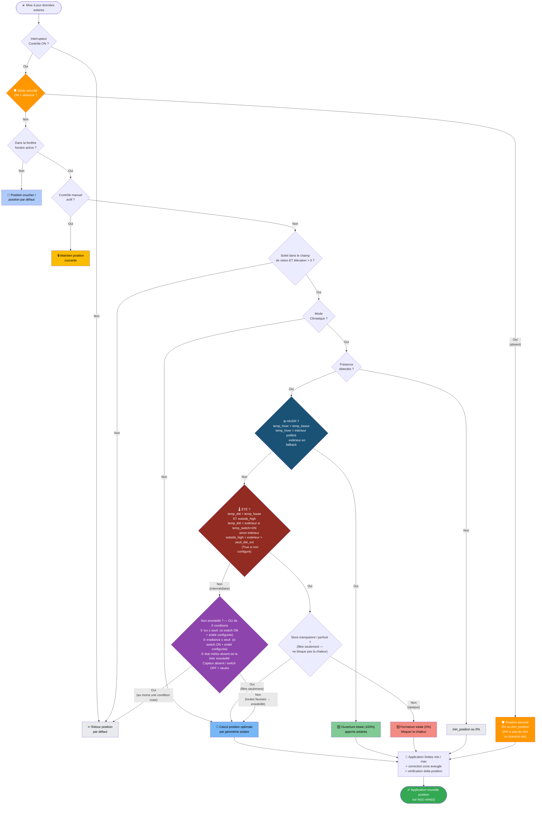

# Adaptive Cover — Documentation française

🇬🇧 [English documentation](README.md)

Cette intégration personnalisée positionne automatiquement vos volets (stores, banne, jalousie) en fonction de la position du soleil par rapport à chaque fenêtre. Elle calcule la position optimale pour bloquer le rayonnement direct tout en conservant la luminosité ambiante, et propose un mode climatique pour réagir aux conditions de température.

Basée sur le capteur template de ce fil de forum : [Automatic Blinds](https://community.home-assistant.io/t/automatic-blinds-sunscreen-control-based-on-sun-platform/)

- [Adaptive Cover](#adaptive-cover--documentation-française)
  - [Fonctionnalités](#fonctionnalités)
  - [Installation](#installation)
    - [HACS (recommandé)](#hacs-recommandé)
    - [Manuelle](#manuelle)
  - [Configuration initiale](#configuration-initiale)
  - [Types de volets](#types-de-volets)
  - [Modes de fonctionnement](#modes-de-fonctionnement)
    - [Mode basique](#mode-basique)
    - [Mode climatique](#mode-climatique)
      - [Stratégies climatiques](#stratégies-climatiques)
    - [Mode sécurité](#mode-sécurité)
  - [Paramètres](#paramètres)
    - [Communs](#communs)
    - [Vertical](#vertical)
    - [Horizontal](#horizontal)
    - [Jalousie (tilt)](#jalousie-tilt)
    - [Automatisation](#automatisation)
    - [Climatique](#climatique)
    - [Zone aveugle](#zone-aveugle)
  - [Entités](#entités)
    - [Entités par groupe de volets](#entités-par-groupe-de-volets)
    - [Entités du hub Tous les volets](#entités-du-hub-tous-les-volets)
  - [Appareil « Tous les volets »](#appareil--tous-les-volets-)
    - [Contrôle vocal (Alexa / Google / Assist)](#contrôle-vocal)
  - [Fonctionnalités planifiées](#fonctionnalités-planifiées)

## Fonctionnalités

- Appareils distincts pour les volets `vertical`, `horizontal` et `jalousie`
- **Trois** modes de stratégie : [`basique`](#mode-basique), [`climatique`](#mode-climatique), [`sécurité`](#mode-sécurité)
- Capteur binaire indiquant quand le soleil est face à la fenêtre
- Capteurs d'heure de début et de fin d'ensoleillement
- Détection automatique du contrôle manuel

- **Mode Climatique**

  - Fonctionnement basé sur les conditions météo
  - Fonctionnement basé sur la présence
  - Interrupteur pour activer/désactiver le mode climatique
  - Capteur indiquant la stratégie active (`hiver`, `intermédiaire`, `été`)
  - Capteur de diagnostic exposant toutes les valeurs intermédiaires de décision

- **Mode Sécurité** *(v1.9+)*

  - Ferme automatiquement les volets quand personne n'est à la maison
  - Interrupteur par groupe (visible uniquement si un capteur de présence est configuré)
  - Interrupteur hub pour activation globale sur tous les groupes
  - L'override manuel résiste toujours — les volets en contrôle manuel ne sont jamais déplacés
  - Retour automatique au positionnement adaptatif quand la présence est restaurée
  - Fail-safe : capteur de présence indisponible → sécurité inactive

- **Contrôle adaptatif**

  - Activation/désactivation du contrôle
  - Contrôle de plusieurs volets simultanément
  - Heure de début pour éviter d'ouvrir les volets pendant le sommeil
  - Intervalle minimum entre deux changements de position
  - Delta minimum de position pour déclencher un changement

- **Appareil « Tous les volets »** *(v1.8+)*

  - Entité volet agrégée contrôlant tous les volets en même temps
  - Sélecteur 4 états (Auto / Arrêt / Tous ouverts / Tous fermés)
  - Interrupteur ON/OFF pour contrôle vocal Alexa
  - Interrupteur sécurité pour Alexa ("Alexa, active la sécurité des volets")
  - Scènes raccourcis pour les automatisations
  - Support natif Alexa, Google Assistant et Assist

## Installation

### HACS (recommandé)

Ajouter `https://github.com/kamahat/adaptive-cover` comme dépôt personnalisé dans HACS.
Rechercher et télécharger *Adaptive Cover* dans HACS.

Redémarrer Home Assistant et ajouter l'intégration.

### Manuelle

Télécharger le dossier `adaptive_cover` depuis ce dépôt GitHub.
Le copier dans `config/custom_components/`.

Redémarrer Home Assistant et ajouter l'intégration.

## Configuration initiale

Adaptive Cover prend en charge trois types de volets : `Vertical`, `Horizontal` et `Jalousie (Vénitien)`.
Chaque type possède ses propres paramètres. Pour configurer un capteur, il faut d'abord déterminer l'azimut de la fenêtre via [Open Street Map Compass](https://osmcompass.com/).

Lors du premier ajout de l'intégration, un menu propose deux options :
- **Ajouter un groupe de volets** — configure un groupe Vertical, Horizontal ou Jalousie (une entrée par fenêtre ou pièce).
- **Ajouter l'agrégateur « Tous les volets »** — crée l'appareil hub singleton qui contrôle tous les groupes en même temps. Créé automatiquement au premier démarrage si absent.

## Types de volets

|              | Vertical                      | Horizontal                      | Jalousie                        |
| ------------ | ----------------------------- | ------------------------------- | ------------------------------- |
|              |  |  |  |
| **Mouvement** | Haut / Bas                   | Déploiement / Rétractation      | Inclinaison des lames           |
|              | [paramètres](#vertical)       | [paramètres](#horizontal)       | [paramètres](#jalousie-tilt)    |

## Modes de fonctionnement

Ce composant propose **trois** modes : un mode `basique`, un mode `climatique` (confort / économie d'énergie) qui intègre la présence et la température, et un mode `sécurité` qui ferme les volets en cas d'absence.

| Mode | Priorité | Description |
|------|----------|-------------|
| `basique` | 3 (base) | Suivi solaire pur |
| `climatique` | 2 | S'adapte à la température — branches été / hiver / intermédiaire |
| `sécurité` | **1 (plus haute)** | Ferme les volets en absence — écrase toute autre logique **y compris hors fenêtre horaire** |

> **Priorité d'exécution** : Sécurité (1) > Climatique (2) > Basique (3).
> La sécurité est évaluée **avant** la fenêtre horaire.
>
> **Classification par seuils — trois branches mutuellement exclusives** (`temp_basse < temp_haute` par construction) :
>
> | Branche | Condition | Température de référence |
> |---------|-----------|--------------------------|
> | **HIVER** | `temp_hiver < temp_basse` | `intérieur` préféré, `extérieur` fallback — toujours |
> | **ÉTÉ** | `temp_été > temp_haute` ET `outside_high` | `extérieur` si `temp_switch=ON`, sinon `intérieur` |
> | **INTERMÉDIAIRE** | ni HIVER ni ÉTÉ | — |
>
> **Pourquoi l'asymétrie ?** HIVER vérifie le confort intérieur. ÉTÉ utilise optionnellement la température extérieure (`temp_switch=ON`) pour confirmer qu'il fait vraiment chaud dehors. **HIVER gagne** dans le cas limite où les deux conditions seraient vraies simultanément (seulement possible quand `temp_switch=ON`).

### Mode basique

Ce mode utilise la position calculée quand le soleil se trouve dans la plage d'azimut définie pour la fenêtre. Sinon, il revient à la valeur par défaut ou à la valeur après coucher selon l'heure de la journée.

### Mode climatique

Ce mode calcule la position en tenant compte de paramètres supplémentaires : présence, température intérieure, seuils de confort et météo (optionnel).

#### Stratégies climatiques

- **Sans présence** : retourne `min_position` (ou 0% si non configuré). Aucun calcul de température.

- **Avec présence** (ou sans entité de présence configurée) :

  - **Hiver** (`temp_hiver < temp_basse`) : ouvre à 100% pour capter la chaleur solaire.
    - `temp_hiver` = température intérieure (extérieure en fallback si intérieure non configurée).
  - **Été** (`temp_été > temp_haute` ET `outside_high`) : ferme ou atténue.
    - `temp_été` = température extérieure si `temp_switch=ON`, sinon intérieure.
    - `outside_high` = guard secondaire : extérieur > `seuil_été_ext` (True par défaut si non configuré).
    - Store transparent/perforé → position calculée (filtrage seulement)
    - Store opaque → ferme à 0%
  - **Intermédiaire** : « non ensoleillé ? » est un **OU** de trois sources indépendantes :
    - `lux ≤ seuil` / `irradiance ≤ seuil` (seulement si switch ON et entité configurée)
    - `état météo absent de la liste « ensoleillé »`
    - Une source vraie → position par défaut. Toutes fausses → calcul adaptatif.

  Pour les jalousies en mode été : les lames se positionnent à 45° ([reconnu comme optimal](https://www.mdpi.com/1996-1073/13/7/1731)).

### Mode sécurité

Le mode sécurité ferme automatiquement les volets quand personne n'est à la maison, indépendamment du mode climatique actif et de la fenêtre horaire configurée.

**Nécessite un capteur de présence** configuré dans les options de l'entrée. Sans capteur, le switch existe mais reste inactif.

| Situation | Position cible |
|---|---|
| Sans mode climatique | 0% (fermeture totale) |
| Climatique + branche `été` | 0% (fermeture totale) |
| Climatique + branche `hiver` ou `intermédiaire` | `min_position` (ou 0% si non configuré) |

**Comportements clés :**
- **L'override manuel résiste toujours**
- **Retour automatique** à la présence
- **Fail-safe** — capteur indisponible → sécurité inactive
- **Hors fenêtre horaire** — la sécurité s'applique quand même

## Paramètres

### Communs

| Paramètre | Défaut | Plage | Description |
| --------- | ------ | ----- | ----------- |
| Entités | [] | | Entités `cover.*` contrôlées par l'intégration |
| Azimut de la fenêtre | 180 | 0-359 | Direction de la fenêtre (trouvable via [Open Street Map Compass](https://osmcompass.com/)) |
| Position par défaut | 60 | 0-100 | Position en l'absence d'éblouissement direct |
| Position minimale | 100 | 0-99 | Position d'ouverture minimale — utilisée aussi par le mode sécurité en hiver/intermédiaire |
| Position maximale | 100 | 1-100 | Position d'ouverture maximale |
| Champ de vision gauche | 90 | 1-90 | Angle de vision non obstrué à gauche de la normale de la fenêtre (°) |
| Champ de vision droite | 90 | 1-90 | Angle de vision non obstrué à droite de la normale de la fenêtre (°) |
| Élévation minimale | Aucune | 0-90 | Élévation solaire minimale prise en compte (°) |
| Élévation maximale | Aucune | 1-90 | Élévation solaire maximale prise en compte (°) |
| Position après coucher | 0 | 0-100 | Position du volet du coucher au lever du soleil |
| Décalage coucher | 0 | | Minutes avant/après le coucher du soleil |
| Décalage lever | 0 | | Minutes avant/après le lever du soleil |
| État inversé | Faux | | Calcule l'état inversé pour les volets fermés à 100% |

### Vertical

| Paramètre | Défaut | Plage | Description |
| --------- | ------ | ----- | ----------- |
| Hauteur de fenêtre | 2,1 | 0,1-6 | Longueur du volet entièrement déployé |
| Zone d'éblouissement | 0,5 | 0,1-2 | Distance (m) depuis le bas du volet où la lumière directe pénètre encore |

### Horizontal

| Paramètre | Défaut | Plage | Description |
| --------- | ------ | ----- | ----------- |
| Hauteur de banne | 2 | 0,1-6 | Hauteur entre la zone de travail et le point de fixation de la banne |
| Longueur de banne | 2,1 | 0,3-6 | Longueur de la banne entièrement déployée |
| Angle de banne | 0 | 0-45 | Angle de la banne par rapport au mur |
| Zone d'éblouissement | 0,5 | 0,1-2 | Distance où la lumière directe atteint encore la zone |

### Jalousie (tilt)

| Paramètre | Défaut | Plage | Description |
| --------- | ------ | ----- | ----------- |
| Profondeur de lame | 3 | 0,1-15 | Largeur de chaque lame |
| Espacement des lames | 2 | 0,1-15 | Distance verticale entre deux lames en position horizontale |
| Mode tilt | Bidirectionnel | | `mode1` : 0°–90° / `mode2` : 0°–180° bidirectionnel |

### Automatisation

| Paramètre | Défaut | Plage | Description |
| --------- | ------ | ----- | ----------- |
| Delta de position minimum | 1 | 1-90 | Changement de position minimal avant qu'un nouveau changement puisse intervenir |
| Delta de temps minimum | 2 | | Intervalle minimal entre deux changements de position (minutes) |
| Heure de début | `"00:00:00"` | | Heure la plus tôt pour un ajustement |
| Entité heure de début | Aucune | | Remplace `heure de début` si défini |
| Durée du contrôle manuel | `15 min` | | Durée minimale de maintien du mode manuel |
| Réinitialisation du timer manuel | Faux | | Remet le timer à zéro à chaque changement en mode manuel |
| Seuil de contrôle manuel | Aucun | 1-99 | Changement de position minimal reconnu comme manuel |
| Ignorer les états intermédiaires | Faux | | Ignorer les événements avec état `opening` ou `closing` |
| Heure de fin | `"00:00:00"` | | Heure la plus tardive pour un ajustement |
| Entité heure de fin | Aucune | | Remplace `heure de fin` si défini |
| Ajuster à l'heure de fin | `Faux` | | Forcer le retour à la position par défaut à l'heure de fin |

### Climatique

| Paramètre | Défaut | Plage | Exemple | Description |
| --------- | ------ | ----- | ------- | ----------- |
| Entité température intérieure | `Aucune` | | `climate.salon` \| `sensor.temp_interieur` | Utilisée pour HIVER ; fallback ÉTÉ si `temp_switch=OFF` |
| Température de confort minimale | 21 | 0-86 | | Seuil HIVER — en-dessous → ouvre 100% |
| Température de confort maximale | 25 | 0-86 | | Seuil ÉTÉ — au-dessus → ferme 0% |
| Entité température extérieure | `Aucune` | | `sensor.temp_exterieur` | Utilisée pour ÉTÉ si `temp_switch=ON` ; fallback HIVER |
| Seuil température extérieure été | `Aucun` | | | Guard secondaire : ÉTÉ s'active seulement si l'extérieur dépasse aussi ce seuil. Inactif si non configuré. |
| Utiliser la temp. extérieure (`temp_switch`) | `Faux` | | | `ON` → temp extérieure prioritaire pour le check ÉTÉ. HIVER utilise toujours l'intérieur. |
| Entité de présence | `Aucune` | | | Utilisée pour le mode climatique **et** le mode sécurité |
| Entité météo | `Aucune` | | `weather.maison` | Source de température si pas de capteur ; pilote aussi le check « non ensoleillé » |
| Conditions météo | `Aucune` | | | États « ensoleillé » — état absent de cette liste → contribue « non ensoleillé » (OU avec lux + irradiance) |
| Store transparent | `Faux` | | | Activer si le store est perforé/maille — filtre seulement, ne bloque pas la chaleur |
| Entité lux | `Aucune` | | `sensor.lux` | Mesure d'éclairement en lux |
| Seuil lux | `1000` | | | En-dessous → contribue « non ensoleillé » (OU avec irradiance + météo). Switch OFF = neutre. |
| Entité irradiance | `Aucune` | | `sensor.irradiance` | Mesure d'irradiance solaire |
| Seuil irradiance | `300` | | | En-dessous → contribue « non ensoleillé » (OU avec lux + météo). Switch OFF = neutre. |

### Zone aveugle

| Paramètre | Défaut | Plage | Description |
| --------- | ------ | ----- | ----------- |
| Zone aveugle gauche | Aucune | 0-max(fov_droite, 180) | Point de départ de la zone aveugle dans le champ de vision |
| Zone aveugle droite | Aucune | 1-max(fov_droite, 180) | Point de fin de la zone aveugle |
| Élévation zone aveugle | Aucune | 0-90 | Élévation solaire minimale pour que la zone aveugle s'applique |

## Entités

### Entités par groupe de volets

Ces entités sont toujours disponibles pour chaque groupe de volets :

| Entité | Défaut | Description |
| ------ | ------ | ----------- |
| `sensor.{type}_cover_position_{nom}` | | Position cible calculée (%) |
| `sensor.{type}_control_method_{nom}` | `intermediate` | Stratégie active : `winter`, `summer`, `intermediate` |
| `sensor.{type}_start_sun_{nom}` | | Heure d'entrée du soleil dans le champ de vision (mise à jour toutes les 5 min) |
| `sensor.{type}_end_sun_{nom}` | | Heure de sortie du soleil du champ de vision |
| `binary_sensor.{type}_manual_override_{nom}` | `off` | Vrai si un contrôle manuel est actif sur l'un des volets |
| `switch.{type}_toggle_control_{nom}` | `on` | Active le contrôle adaptatif |
| `switch.{type}_manual_override_{nom}` | `on` | Active la détection des contrôles manuels |
| `button.{type}_reset_manual_override_{nom}` | | Réinitialise les marqueurs manuels pour tous les volets du groupe |

Quand le mode climatique est configuré :

| Entité | Défaut | Description |
| ------ | ------ | ----------- |
| `switch.{type}_climate_mode_{nom}` | `on` | Active la stratégie climatique |
| `switch.{type}_outside_temperature_{nom}` | `off` | `temp_switch` — temp extérieure prioritaire pour le check ÉTÉ |
| `switch.{type}_lux_{nom}` | `on` | Active le seuil lux — OFF = lux ignoré (neutre) |
| `switch.{type}_irradiance_{nom}` | `on` | Active le seuil d'irradiance — OFF = irradiance ignorée (neutre) |
| `sensor.{type}_climate_debug_{nom}` | | Capteur de diagnostic avec snapshot complet de la décision climatique |

Quand un **capteur de présence** est configuré :

| Entité | Défaut | Description |
| ------ | ------ | ----------- |
| `switch.{type}_security_mode_{nom}` | **`off`** | **Mode sécurité** — ferme les volets quand aucune présence n'est détectée |

### Entités du hub Tous les volets

L'appareil **Tous les volets** (créé automatiquement au premier démarrage) expose :

| Entité | Nom | Description |
| ------ | --- | ----------- |
| `cover.*` | **Les volets** | Volet agrégé — ouverture/fermeture/position agit sur tous les volets |
| `switch.*` | **Les volets** | Interrupteur ON/OFF du contrôle adaptatif sur toutes les entrées |
| `switch.*` | **Sécurité volets** | Interrupteur ON/OFF du **mode sécurité** sur toutes les entrées avec capteur de présence |
| `select.*` | **Mode de contrôle** | Sélecteur 4 états : Auto / Arrêt / Tous ouverts (100%) / Tous fermés (0%) |
| `scene.*_all_open` | **Volets ouverts** | Met tous les volets à 100% |
| `scene.*_all_closed` | **Volets fermés** | Met tous les volets à 0% |

## Appareil « Tous les volets »

L'entrée **Tous les volets** est un agrégateur singleton créé automatiquement au premier chargement de l'intégration. Il possède sa propre carte dans l'interface HA et n'interfère pas avec les paramètres individuels de chaque groupe.

Il peut aussi être ajouté manuellement : **Paramètres → Intégrations → Adaptive Cover → Ajouter une entrée → Ajouter l'agrégateur « Tous les volets »**.

### Contrôle vocal

| Commande vocale | Entité déclenchée | Action |
|---|---|---|
| *« Alexa, active les volets »* | switch **Les volets** ON | Contrôle adaptatif activé |
| *« Alexa, désactive les volets »* | switch **Les volets** OFF | Contrôle adaptatif désactivé |
| *« Alexa, ouvre les volets »* | cover **Les volets** open | Tous les volets → 100% |
| *« Alexa, ferme les volets »* | cover **Les volets** close | Tous les volets → 0% |
| *« Alexa, active la sécurité des volets »* | switch **Sécurité volets** ON | Mode sécurité activé |
| *« Alexa, désactive la sécurité des volets »* | switch **Sécurité volets** OFF | Mode sécurité désactivé |

> Alexa route les commandes par type d'entité : `active/désactive` → switch, `ouvre/ferme` → cover.

## Fonctionnalités planifiées

- Contrôles de dérogation manuelle

  - ~~Durée avant retour au contrôle adaptatif~~
  - ~~Bouton de réinitialisation~~
  - Attendre le prochain changement manuel / non adaptatif

- ~~Algorithme de contrôle du rayonnement et/ou de l'éclairement~~

---

## Contributeurs

| | Contributeur | Rôle |
|---|---|---|
| 🧑‍💻 | **[Kamahat](https://github.com/kamahat)** | Mainteneur du fork, développement, correctifs |
| 🤖 | **[Claude Opus 4.7](https://claude.ai)** (Anthropic) | Revue de code, correctifs, documentation EN/FR, changelog |
| ⭐ | **[Bas Brussee (@basbruss)](https://github.com/basbruss)** | Auteur original |

Voir [CONTRIBUTORS.md](CONTRIBUTORS.md) pour la liste complète incluant les contributeurs de la communauté.
