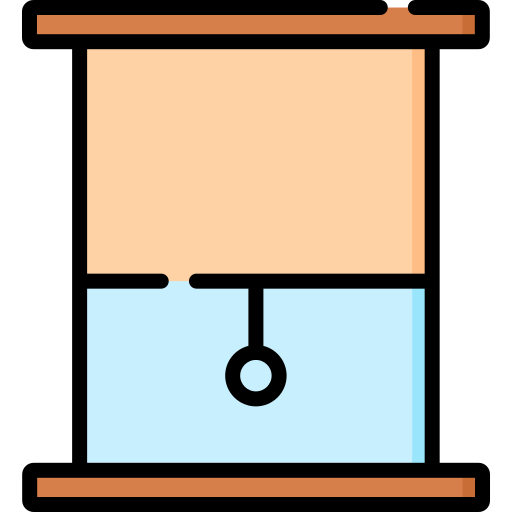
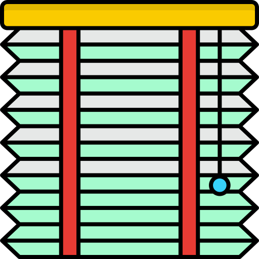
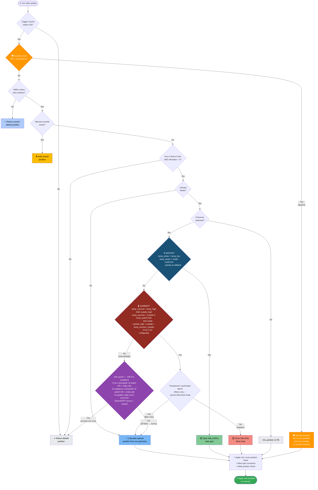

🇫🇷 [Documentation en français](README.fr.md)

# Adaptive Cover

This Custom-Integration provides sensors for vertical and horizontal blinds based on the sun's position by calculating the position to filter out direct sunlight.

This integration builds upon the template sensor from this forum post [Automatic Blinds](https://community.home-assistant.io/t/automatic-blinds-sunscreen-control-based-on-sun-platform/)

- [Adaptive Cover](#adaptive-cover)
  - [Features](#features)
  - [Installation](#installation)
    - [HACS (Recommended)](#hacs-recommended)
    - [Manual](#manual)
  - [Setup](#setup)
  - [Cover Types](#cover-types)
  - [Modes](#modes)
    - [Basic mode](#basic-mode)
    - [Climate mode](#climate-mode)
      - [Climate strategies](#climate-strategies)
    - [Security mode](#security-mode)
  - [Variables](#variables)
    - [Common](#common)
    - [Vertical](#vertical)
    - [Horizontal](#horizontal)
    - [Tilt](#tilt)
    - [Automation](#automation)
    - [Climate](#climate)
    - [Blindspot](#blindspot)
  - [Entities](#entities)
    - [Per-cover entry entities](#per-cover-entry-entities)
    - [All Blinds hub entities](#all-blinds-hub-entities)
  - [All Blinds hub device](#all-blinds-hub-device)
    - [Voice control (Alexa / Google / Assist)](#voice-control)
  - [Features Planned](#features-planned)

## Features

- Individual service devices for `vertical`, `horizontal` and `tilted` covers
- **Three** strategy modes: [`basic`](#basic-mode), [`climate`](#climate-mode), [`security`](#security-mode)
- Binary Sensor to track when the sun is in front of the window
- Sensors for `start` and `end` time
- Auto manual override detection

- **Climate Mode**

  - Weather condition based operation
  - Presence based operation
  - Switch to toggle climate mode
  - Sensor for displaying the operation modus (`winter`, `intermediate`, `summer`)
  - Diagnostic sensor exposing all intermediate climate decision values

- **Security Mode** *(v1.9+)*

  - Automatically closes covers when nobody is home
  - Per-group switch (visible only when a presence entity is configured)
  - Hub switch for global activation across all groups
  - Manual override always wins — covers in manual control are never moved
  - Automatic return to adaptive positioning when presence is restored
  - Fail-safe: unavailable presence sensor → security stays inactive

- **Adaptive Control**

  - Turn control on/off
  - Control multiple covers
  - Set start time to prevent opening blinds while you are asleep
  - Set minimum interval time between position changes
  - Set minimum percentage change

- **All Blinds hub device** *(v1.8+)*

  - Single aggregate cover entity controlling every blind at once
  - 4-state control select (Auto / Off / All open / All closed)
  - ON/OFF switch for Alexa voice control ("Alexa, turn on / turn off the blinds")
  - Security switch for Alexa ("Alexa, activate blind security")
  - Scene shortcuts for automations
  - Native Alexa, Google Assistant and Assist support

## Installation

### HACS (Recommended)

Add <https://github.com/kamahat/adaptive-cover> as custom repository to HACS.
Search and download Adaptive Cover within HACS.

Restart Home-Assistant and add the integration.

### Manual

Download the `adaptive_cover` folder from this github.
Add the folder to `config/custom_components/`.

Restart Home-Assistant and add the integration.

## Setup

Adaptive Cover supports (for now) three types of covers/blinds; `Vertical` and `Horizontal` and `Venetian (Tilted)` blinds.
Each type has its own specific parameters to setup a sensor. To setup the sensor you first need to find out the azimuth of the window(s). This can be done by finding your location on [Open Street Map Compass](https://osmcompass.com/).

When adding the integration for the first time, a menu is shown:
- **Add a cover group** — configure a Vertical, Horizontal or Tilt blind group (one per window or room).
- **Add 'All Blinds' aggregator** — creates the singleton hub device that controls all groups at once. Created automatically on first setup if not yet present.

## Cover Types

|              | Vertical                      | Horizontal                      | Tilted                          |
| ------------ | ----------------------------- | ------------------------------- | ------------------------------- |
|              |  |  |  |
| **Movement** | Up/Down                       | In/Out                          | Tilting                         |
|              | [variables](#vertical)        | [variables](#horizontal)        | [variables](#tilt)              |

## Modes

This component supports **three** strategy modes: a `basic` mode, a `climate` (comfort/energy saving) mode that works with presence and temperature detection, and a `security` mode that closes covers when nobody is home.

| Mode | Priority | Description |
|------|----------|-------------|
| `basic` | 3 (base) | Pure sun-position tracking |
| `climate` | 2 | Adapts to temperature — summer / winter / intermediate |
| `security` | **1 (highest)** | Closes covers on absence — overrides all other logic **including outside the time window** |

```mermaid
flowchart TD
    START(["☀️ Sun data update"])

    START --> CTRL{"Toggle Control\nswitch ON?"}
    CTRL -- No --> DEFAULT["↩️ Return default\nposition"]

    CTRL -- Yes --> SECURITY{"🛡️ Security mode\nON + no presence?"}
    SECURITY -- "Yes\n(absent)" --> SECPOS["🛡️ Security position\n0% or min_position\n(0% if no climate\nor summer branch)"]
    SECURITY -- No --> TIME{"Within active\ntime window?"}
    TIME -- No --> SUNSET["🌙 Return sunset /\ndefault position"]

    TIME -- Yes --> MANUAL{"Manual override\nactive?"}
    MANUAL -- Yes --> HOLD["🔒 Hold current\nposition"]

    MANUAL -- No --> SUN{"Sun in field of view\nAND elevation > 0?"}
    SUN -- No --> DEFAULT

    SUN -- Yes --> CLMODE{"Climate\nMode?"}

    %% ── BASIC MODE ────────────────────────────────
    CLMODE -- No --> CALC["📐 Calculate optimal\nposition from sun geometry"]
    CALC --> LIMITS

    %% ── CLIMATE MODE ──────────────────────────────
    CLMODE -- Yes --> PRES{"Presence\ndetected?"}
    PRES -- "No" --> PNONE["min_position or 0%"]

    PRES -- "Yes" --> WCHECK{"❄️ WINTER?\ntemp_winter < temp_low\ntemp_winter = inside preferred\n              outside as fallback"}
    WCHECK -- Yes --> OPEN["🪟 Open fully (100%)\nsolar gain"]

    WCHECK -- No --> SCHECK{"🌡️ SUMMER?\ntemp_summer > temp_high\nAND outside_high\ntemp_summer = outside if temp_switch=ON\n              else inside\noutside_high = outside > temp_summer_outside\n              (True if not configured)"}
    SCHECK -- Yes --> TRANSP{"Transparent / perforated blind?\n(filters only —\ncannot fully block heat)"}
    TRANSP -- "Yes\n(filter only)" --> CALC
    TRANSP -- "No\n(opaque)" --> CLOSE["🪟 Close fully (0%)\nblock heat"]

    SCHECK -- "No\n(intermediate)" --> LIGHT{"Not sunny? — OR of 3 conditions\n① lux ≤ threshold  (if switch ON + entity set)\n② irradiance ≤ threshold  (if switch ON + entity set)\n③ weather state not in sunny list\nAbsent/OFF sensor = neutral"}
    LIGHT -- "Yes\n(at least one true)" --> DEFAULT
    LIGHT -- "No\n(all false → sunny)" --> CALC

    %% ── COMMON FINAL STEPS ────────────────────────
    LIMITS["🔧 Apply min / max position limits\n+ blind spot correction\n+ delta position check"]
    OPEN --> LIMITS
    CLOSE --> LIMITS
    PNONE --> LIMITS
    SECPOS --> LIMITS

    LIMITS --> RESULT(["✅ Apply new position\nto cover(s)"])

    %% ── STYLES ────────────────────────────────────
    style CLOSE   fill:#f28b82,color:#000
    style OPEN    fill:#81c995,color:#000
    style CALC    fill:#78b7f5,color:#000
    style RESULT  fill:#34a853,color:#fff
    style HOLD    fill:#fbbc04,color:#000
    style SUNSET  fill:#aecbfa,color:#000
    style DEFAULT fill:#e8eaed,color:#000
    style SECURITY fill:#ff9800,color:#fff,stroke:#e65100
    style SECPOS   fill:#ff9800,color:#fff,stroke:#e65100
    style PNONE    fill:#e8eaed,color:#000
    style LIGHT    fill:#8e44ad,color:#fff,stroke:#6c3483
    style WCHECK  fill:#1a5276,color:#fff
    style SCHECK  fill:#922b21,color:#fff
```

> **Execution priority**: Security (1) > Climate (2) > Basic (3).
> Security is evaluated **before** the time window check.
>
> **Climate classification — three mutually exclusive branches** (`temp_low < temp_high` by design):
>
> | Branch | Condition | Temp reference |
> |--------|-----------|----------------|
> | **WINTER** | `temp_winter < temp_low` | `inside` preferred, `outside` fallback — always |
> | **SUMMER** | `temp_summer > temp_high` AND `outside_high` | `outside` if `temp_switch=ON`, else `inside` |
> | **INTERMEDIATE** | neither WINTER nor SUMMER | — |
>
> **Why the asymmetry?** WINTER checks indoor comfort. SUMMER optionally uses outdoor temp (`temp_switch=ON`) to confirm genuine heat outside. **WINTER wins** in the edge case where both conditions are true simultaneously (only possible when `temp_switch=ON`).

### Basic mode

This mode uses the calculated position when the sun is within the specified azimuth range of the window. Else it defaults to the default value or after sunset value depending on the time of day.

### Climate mode

This mode calculates the position based on extra parameters for presence, indoor temperature, minimal comfort temperature, maximum comfort temperature and weather (optional).

#### Climate strategies

- **No Presence**: Returns `min_position` (or 0% if not configured). No temperature calculation needed.

- **Presence** (or no Presence Entity set):

  - **Winter** (`temp_winter < temp_low`): Opens fully (100%) to capture solar heat.
    - `temp_winter` = indoor temperature (outdoor as fallback if indoor not configured).
  - **Summer** (`temp_summer > temp_high` AND `outside_high`): Closes or shades.
    - `temp_summer` = outdoor temperature if `temp_switch=ON`, else indoor.
    - `outside_high` = extra guard: outdoor > `temp_summer_outside` threshold (True by default if not set).
    - Transparent/perforated blind → calculate position (filtering only)
    - Opaque blind → close fully (0%)
  - **Intermediate**: "not sunny?" is an **OR** of three independent sources:
    - `lux ≤ threshold` / `irradiance ≤ threshold` (only if switch ON and entity configured)
    - `weather state not in sunny list`
    - One source true → default position. All false → adaptive calculation.

  For tilted blinds above summer threshold: slats positioned at 45° ([found optimal](https://www.mdpi.com/1996-1073/13/7/1731)).

### Security mode

Security mode closes covers automatically when nobody is home, regardless of the current climate branch and regardless of the configured time window.

**Requires a presence entity** to be configured in the entry options. Without one, the switch exists but has no effect.

| Situation | Target position |
|---|---|
| No climate mode | 0% (fully closed) |
| Climate mode + `summer` branch | 0% (fully closed) |
| Climate mode + `winter` or `intermediate` | `min_position` (or 0% if unset) |

**Key behaviours:**
- **Manual override always wins** — covers already in manual control are never moved by security
- **Automatic return** — when presence is restored, adaptive positioning resumes without manual action
- **Fail-safe** — unavailable presence sensor → security inactive
- **Outside time window** — security applies even outside the configured start/end hours

## Variables

### Common

| Variables                     | Default | Range | Description                                                                                              |
| ----------------------------- | ------- | ----- | -------------------------------------------------------------------------------------------------------- |
| Entities                      | []      |       | Denotes entities controllable by the integration                                                         |
| Window Azimuth                | 180     | 0-359 | The compass direction of the window, discoverable via [Open Street Map Compass](https://osmcompass.com/) |
| Default Position              | 60      | 0-100 | Initial position of the cover in the absence of sunlight glare detection                                 |
| Minimal Position              | 100     | 0-99  | Minimal opening position for the cover — also used by security mode in winter/intermediate               |
| Maximum Position              | 100     | 1-100 | Maximum opening position for the cover                                                                   |
| Field of view Left            | 90      | 1-90  | Unobstructed viewing angle from window center to the left, in degrees                                    |
| Field of view Right           | 90      | 1-90  | Unobstructed viewing angle from window center to the right, in degrees                                   |
| Minimal Elevation             | None    | 0-90  | Minimal elevation degree of the sun to be considered                                                     |
| Maximum Elevation             | None    | 1-90  | Maximum elevation degree of the sun to be considered                                                     |
| Default position after Sunset | 0       | 0-100 | Cover's default position from sunset to sunrise                                                          |
| Offset Sunset time            | 0       |       | Additional minutes before/after sunset                                                                   |
| Offset Sunrise time           | 0       |       | Additional minutes before/after sunrise                                                                  |
| Inverse State                 | False   |       | Calculates inverse state for covers fully closed at 100%                                                 |

### Vertical

| Variables         | Default | Range | Description                                                                                 |
| ----------------- | ------- | ----- | ------------------------------------------------------------------------------------------- |
| Window Height     | 2.1     | 0.1-6 | Length of fully extended cover/window                                                       |
| Glare Zone        | 0.5     | 0.1-2 | Objects within this distance of the cover receive direct sunlight |

### Horizontal

| Variables                  | Default | Range | Description                                    |
| -------------------------- | ------- | ----- | ---------------------------------------------- |
| Awning Height              | 2       | 0.1-6 | Height from work area to awning mounting point |
| Awning Length (horizontal) | 2.1     | 0.3-6 | Length of the awning when fully extended       |
| Awning Angle               | 0       | 0-45  | Angle of the awning from the wall              |
| Glare Zone                 | 0.5     | 0.1-2 | Objects within this distance of the cover receive direct sunlight |

### Tilt

| Variables     | Default        | Range  | Description                                                |
| ------------- | -------------- | ------ | ---------------------------------------------------------- |
| Slat Depth    | 3              | 0.1-15 | Width of each slat                                         |
| Slat Distance | 2              | 0.1-15 | Vertical distance between two slats in horizontal position |
| Tilt Mode     | Bi-directional |        | `mode1`: single direction 0°–90° / `mode2`: bi-directional 0°–180° |

### Automation

| Variables                                  | Default      | Range | Description                                                                                    |
| ------------------------------------------ | ------------ | ----- | ---------------------------------------------------------------------------------------------- |
| Minimum Delta Position                     | 1            | 1-90  | Minimum position change required before another change can occur                               |
| Minimum Delta Time                         | 2            |       | Minimum time gap between position changes (minutes)                                            |
| Start Time                                 | `"00:00:00"` |       | Earliest time a cover can be adjusted after midnight                                           |
| Start Time Entity                          | None         |       | Overrides `start_time` if set                                                                  |
| Manual Override Duration                   | `15 min`     |       | Minimum duration for manual control status to remain active                                    |
| Manual Override reset Timer                | False        |       | Resets duration timer each time the position changes while the manual control status is active |
| Manual Override Threshold                  | None         | 1-99  | Minimal position change to be recognized as manual change                                      |
| Manual Override ignore intermediate states | False        |       | Ignore StateChangedEvents that have state `opening` or `closing`                               |
| End Time                                   | `"00:00:00"` |       | Latest time a cover can be adjusted each day                                                   |
| End Time Entity                            | None         |       | Overrides `end_time` if set                                                                    |
| Adjust at end time                         | `False`      |       | Make sure to always update the position to the default setting at the end time                 |

### Climate

| Variables                     | Default | Range | Example                                       | Description |
| ----------------------------- | ------- | ----- | --------------------------------------------- | ----------- |
| Indoor Temperature Entity     | `None`  |       | `climate.living_room` \| `sensor.indoor_temp` | Used for WINTER check; fallback for SUMMER when `temp_switch=OFF` |
| Minimum Comfort Temperature   | 21      | 0-86  |                                               | WINTER threshold — below this, open 100% for solar gain |
| Maximum Comfort Temperature   | 25      | 0-86  |                                               | SUMMER threshold — above this, close 0% to block heat |
| Outdoor Temperature Entity    | `None`  |       | `sensor.outdoor_temp`                         | Used for SUMMER when `temp_switch=ON`; optional WINTER fallback |
| Outdoor Temperature Threshold | `None`  |       |                                               | Extra SUMMER guard: activates only when outdoor temp also exceeds this. Inactive when not set. |
| Use Outside Temperature (`temp_switch`) | `False` | | | `ON` → outdoor temp primary for SUMMER check. WINTER always uses indoor. |
| Presence Entity               | `None`  |       |                                               | Used for both climate mode AND security mode |
| Weather Entity                | `None`  |       | `weather.home`                                | Temperature source when no sensor; also drives "not sunny" check |
| Weather Condition             | `None`  |       |                                               | States considered "sunny" — state not in list → contributes "not sunny" (OR with lux + irradiance) |
| Transparent Blind             | `False` |       |                                               | Enable if blind is perforated/mesh — filters only, keeps adaptive positioning in summer |
| Lux Entity                    | `None`  |       | `sensor.lux`                                  | Measured lux |
| Lux Threshold                 | `1000`  |       |                                               | Below threshold → "not sunny" (OR with irradiance + weather). Switch OFF = neutral. |
| Irradiance Entity             | `None`  |       | `sensor.irradiance`                           | Measured irradiance |
| Irradiance Threshold          | `300`   |       |                                               | Below threshold → "not sunny" (OR with lux + weather). Switch OFF = neutral. |

### Blindspot

| Variables            | Default | Range                 | Description |
| -------------------- | ------- | --------------------- | ----------- |
| Blind Spot Left      | None    | 0-max(fov_right, 180) | Start point of the blind spot on the predefined field of view |
| Blind Spot Right     | None    | 1-max(fov_right, 180) | End point of the blind spot on the predefined field of view |
| Blind Spot Elevation | None    | 0-90                  | Minimal sun elevation for the blindspot to apply |

## Entities

### Per-cover entry entities

The integration dynamically adds multiple entities based on the used features.

These entities are always available for each cover group:

| Entity | Default | Description |
| ------ | ------- | ----------- |
| `sensor.{type}_cover_position_{name}` | | Reflects the current target position (%) |
| `sensor.{type}_control_method_{name}` | `intermediate` | Active strategy: `winter`, `summer`, `intermediate` |
| `sensor.{type}_start_sun_{name}` | | Time when the sun enters the window's FOV (updated every 5 min) |
| `sensor.{type}_end_sun_{name}` | | Time when the sun exits the window's FOV (updated every 5 min) |
| `binary_sensor.{type}_manual_override_{name}` | `off` | True when manual override is active for any blind in the group |
| `switch.{type}_toggle_control_{name}` | `on` | Activates adaptive control |
| `switch.{type}_manual_override_{name}` | `on` | Enables detection of manual overrides |
| `button.{type}_reset_manual_override_{name}` | | Resets manual override tags for all covers in the group |

When climate mode is configured:

| Entity | Default | Description |
| ------ | ------- | ----------- |
| `switch.{type}_climate_mode_{name}` | `on` | Enables climate mode strategy |
| `switch.{type}_outside_temperature_{name}` | `off` | `temp_switch` — outdoor temp primary for SUMMER check |
| `switch.{type}_lux_{name}` | `on` | Enable lux threshold — OFF = lux ignored (neutral) |
| `switch.{type}_irradiance_{name}` | `on` | Enable irradiance threshold — OFF = irradiance ignored (neutral) |
| `sensor.{type}_climate_debug_{name}` | | Diagnostic sensor with full climate decision snapshot |

When a **presence entity** is configured:

| Entity | Default | Description |
| ------ | ------- | ----------- |
| `switch.{type}_security_mode_{name}` | **`off`** | **Security mode** — closes covers when no presence detected |

### All Blinds hub entities

The **All Blinds** device (auto-created on first setup) exposes:

| Entity | Name | Description |
| ------ | ---- | ----------- |
| `cover.*` | **Les volets** | Aggregate cover — open/close/set position acts on all covers |
| `switch.*` | **Les volets** | ON/OFF adaptive control across all entries |
| `switch.*` | **Sécurité volets** | ON/OFF **security mode** across all entries that have a presence entity |
| `select.*` | **Control mode** | 4-state: Auto / Off / All open (100%) / All closed (0%) |
| `scene.*_all_open` | **Blinds open** | Sets all covers to 100% |
| `scene.*_all_closed` | **Blinds closed** | Sets all covers to 0% |

## All Blinds hub device

The **All Blinds** entry is a singleton aggregator automatically created when the integration first loads. It has its own device card in the HA UI and does not interfere with individual cover group settings.

It can also be added manually: **Settings → Integrations → Adaptive Cover → Add entry → Add 'All Blinds' aggregator**.

### Voice control

The hub device is designed for native voice assistant integration — no custom routines needed:

| Voice phrase | Entity triggered | Action |
|---|---|---|
| *"Alexa, turn on the blinds"* | switch **Les volets** ON | Adaptive control enabled, manual overrides cleared |
| *"Alexa, turn off the blinds"* | switch **Les volets** OFF | Adaptive control disabled |
| *"Alexa, open the blinds"* | cover **Les volets** open | All covers → 100% |
| *"Alexa, close the blinds"* | cover **Les volets** close | All covers → 0% |
| *"Alexa, activate blind security"* | switch **Sécurité volets** ON | Security mode enabled — covers close on absence |
| *"Alexa, deactivate blind security"* | switch **Sécurité volets** OFF | Security mode disabled |

> Alexa routes commands by verb type: `turn on/off` → switch, `open/close` → cover.  
> The same entity names work with **Google Assistant** and **Assist**.

To re-sync Alexa after upgrading: say *"Alexa, discover my devices"* or go to the Alexa app → Devices → More → Discover devices.

## Features Planned

- Manual override controls

  - ~~Time to revert back to adaptive control~~
  - ~~Reset button~~
  - Wait until next manual/none adaptive change

- ~~Algorithm to control radiation and/or illumination~~

---

## Contributors

| | Contributor | Role |
|---|---|---|
| 🧑‍💻 | **[Kamahat](https://github.com/kamahat)** | Fork maintainer, feature development, bug fixes |
| 🤖 | **[Claude Opus 4.7](https://claude.ai)** (Anthropic) | Code review, bug fixes, EN/FR documentation, changelog |
| ⭐ | **[Bas Brussee (@basbruss)](https://github.com/basbruss)** | Original author |

See [CONTRIBUTORS.md](CONTRIBUTORS.md) for the full list including community contributors.
