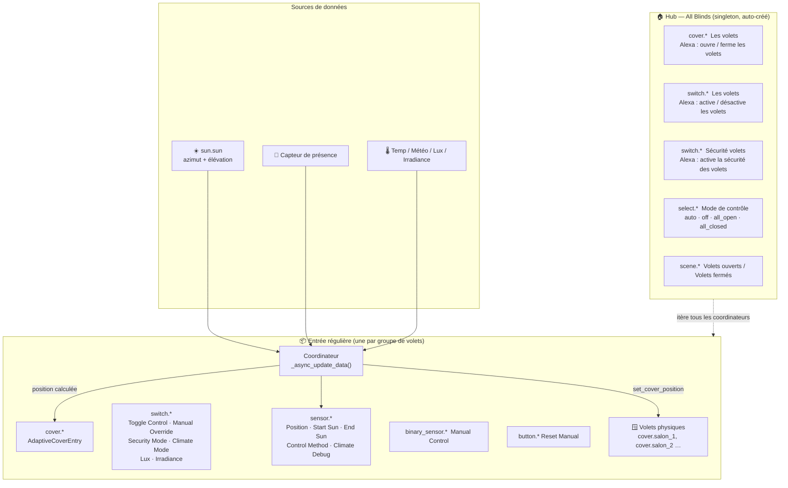
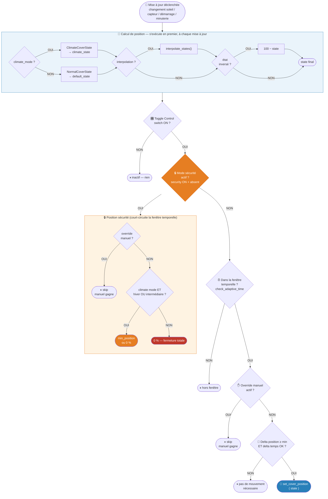
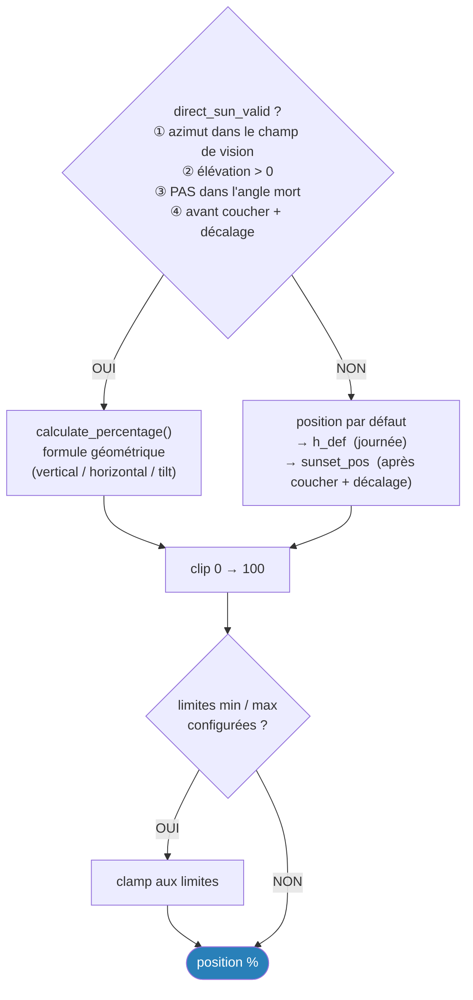
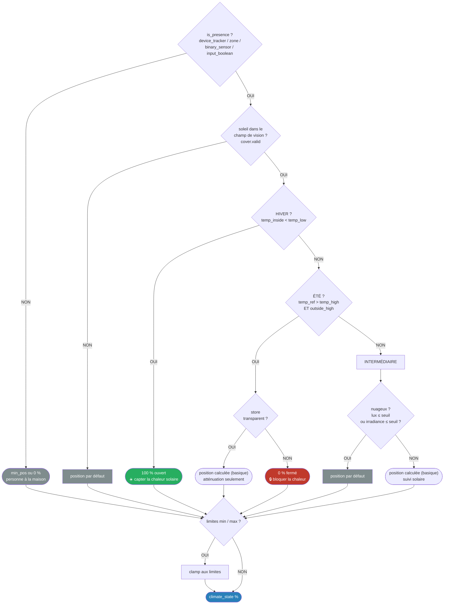

# Adaptive Cover — Documentation française

🇬🇧 [English documentation](README.md)

[](CHANGELOG.md)
[](https://www.home-assistant.io)

Positionnez automatiquement vos volets (stores, banne, jalousie) en fonction de la position du soleil.

---

## Modes

Ce composant prend en charge **trois** modes de stratégie :

| Mode | Activation | Priorité | Description |
|------|-----------|----------|-------------|
| `basic` | Toujours actif | 3 (base) | Suivi solaire pur |
| `climate` | `switch.climate_mode` ON | 2 | S'adapte à la température — branches été / hiver / intermédiaire |
| `security` | `switch.security_mode` ON + absence | **1 (plus haute)** | Ferme les volets en cas d'absence — écrase toute autre logique |

> **Sécurité > Climatique > Basique** — la sécurité prend toujours le dessus quand elle est active.

---

## Architecture



---

## Flux de contrôle — par volet, par mise à jour

Chaque changement d'état (soleil, capteur) déclenche un refresh du coordinateur. Pour chaque volet physique :



> **Refresh minuté** (coucher de soleil) : même vérification sécurité, puis applique `sunset_pos` directement — sans vérification manuel/delta.
>
> **Changement d'état du volet** : ne positionne pas ; détecte les déplacements manuels et marque le volet comme `manual_controlled`.

---

## Calcul de position — détail

### Mode Basique



### Mode Climatique



---

## Types de volets

| Type | Description |
|------|-------------|
| **Store vertical** (`cover_blind`) | Store enrouleur — position en % (0 = ouvert, 100 = fermé) |
| **Banne horizontale** (`cover_awning`) | Banne extérieure déployée horizontalement |
| **Jalousie / tilt** (`cover_tilt`) | Store vénitien avec réglage de l'angle des lames |

---

## Installation

### HACS (recommandé)

1. Dans HACS → **Intégrations → Dépôts personnalisés**
2. Ajouter `https://github.com/kamahat/adaptive-cover` (catégorie : Intégration)
3. Rechercher *Adaptive Cover* et installer
4. Redémarrer Home Assistant

### Manuelle

1. Copier `adaptive_cover` dans `config/custom_components/`
2. Redémarrer Home Assistant

---

## Configuration

Ajouter via **Paramètres → Appareils & Services → Ajouter → Adaptive Cover**.

### Base (obligatoire)

| Option | Description |
|--------|-------------|
| **Nom** | Libellé du groupe de volets |
| **Type de volet** | Vertical / Horizontal / Jalousie |
| **Azimut** | Direction de la fenêtre en degrés (0 = N, 90 = E, 180 = S, 270 = O) |
| **Champ de vision gauche / droite** | Plage angulaire (°) de part et d'autre de la normale |
| **Hauteur de la fenêtre** | Hauteur en mètres |
| **Profondeur de la zone ombragée** | Profondeur (m) à maintenir à l'ombre |
| **Position par défaut** | Position de repli (%) hors champ de vision |

### Groupe de volets

| Option | Description |
|--------|-------------|
| **Volets** | Entités `cover.*` contrôlées par cette entrée |

### Fenêtre temporelle

| Option | Description |
|--------|-------------|
| **Heure de début / entité** | Début du contrôle adaptatif |
| **Heure de fin / entité** | Fin du contrôle adaptatif |
| **Décalage lever / coucher** | Décalage en minutes par rapport au soleil |
| **Position au coucher** | Position appliquée au coucher du soleil |
| **Retour au coucher** | Restaurer la position par défaut plutôt que la position coucher |

### Limites de position

| Option | Description |
|--------|-------------|
| **Position minimale** | Seuil bas (%) — utilisé aussi par le mode sécurité en hiver/intermédiaire |
| **Position maximale** | Seuil haut (%) |

### Zone aveugle

| Option | Description |
|--------|-------------|
| **Activer** | Active la fonctionnalité |
| **Zone aveugle gauche / droite** | Plage d'azimut (°) |
| **Élévation de la zone aveugle** | Élévation solaire minimale (°) |

### Jalousie (tilt)

| Option | Description |
|--------|-------------|
| **Profondeur de lame** | Profondeur physique (mm) |
| **Espacement des lames** | Espace entre les lames (mm) |
| **Mode tilt** | `mode1` — 0°–90° ; `mode2` — 0°–180° bidirectionnel |

### Mode climatique

À activer via **Paramètres → [entrée] → Configurer → Paramètres climatiques**.

| Option | Description |
|--------|-------------|
| **Entité de température** | Capteur intérieur |
| **Entité de température extérieure** | Capteur extérieur (optionnel) |
| **Entité météo** | Source de température si pas de capteur |
| **Temp basse / haute** | Seuils hiver / été (°C) |
| **Utiliser la température extérieure** | Comparer la temp. ext. à `temp_haute` |
| **Conditions météo** | États météo considérés comme « ensoleillé » |
| **Entité de présence** | Utilisée pour le mode climatique **et** le mode sécurité |

### Mode sécurité

> Nécessite un **capteur de présence** configuré. Sans capteur, le switch est inactif même s'il est ON.

| Situation | Position cible |
|---|---|
| Sans mode climatique | 0 % (fermeture totale) |
| Climatique + branche `summer` | 0 % (fermeture totale) |
| Climatique + branche `winter` ou `intermediate` | `CONF_MIN_POSITION` (ou 0 si non configuré) |

- Override manuel résiste — le volet en contrôle manuel n'est pas touché
- Retour automatique à la présence sans intervention manuelle
- Fail-safe — capteur `unavailable` → sécurité inactive

### Seuil lumineux

| Option | Description |
|--------|-------------|
| **Lux / seuil** | En-dessous → considéré « non ensoleillé » en mode intermédiaire |
| **Irradiance / seuil** | Idem |

### Contrôle manuel

| Option | Description |
|--------|-------------|
| **Durée** | Minutes de pause après déplacement manuel |
| **Réinitialisation** | Heure de réinitialisation automatique |
| **Seuil de déplacement** | Delta (%) considéré comme un déplacement manuel |
| **Ignorer les intermédiaires** | Seuls les mouvements complets ouvert/fermé comptent |

---

## Entités créées

### Appareil « All Blinds » (hub)

| Entité | Nom | Alexa | Description |
|--------|-----|-------|-------------|
| `cover.*` | Les volets | "ouvre / ferme les volets" | Aggregate cover — toutes les entrées |
| `switch.*` | Les volets | "active / désactive les volets" | Contrôle adaptatif ON/OFF |
| `switch.*` | Sécurité volets | "active la sécurité des volets" | Mode sécurité — entrées avec présence |
| `select.*` | Mode de contrôle | — | `auto` · `off` · `all_open` · `all_closed` |
| `scene.*_all_open` | Volets ouverts | "allume Volets ouverts" | Tous à 100 % |
| `scene.*_all_closed` | Volets fermés | "allume Volets fermés" | Tous à 0 % |

### Appareils par entrée régulière

| Entité | Défaut | Description |
|--------|--------|-------------|
| `cover.<nom>` | — | Entité principale — position adaptative, open/close/set_position |
| `switch.toggle_control_<nom>` | ON | Activer / désactiver le positionnement adaptatif |
| `switch.manual_override_<nom>` | ON | Pause manuelle (auto-activé sur déplacement) |
| `switch.security_mode_<nom>` | **OFF** | Mode sécurité *(visible si présence configurée)* |
| `switch.climate_mode_<nom>` | ON | Mode climatique *(visible si configuré)* |
| `switch.outside_temperature_<nom>` | OFF | Temp. ext. pour détection été |
| `switch.lux_<nom>` | ON | Seuil lux |
| `switch.irradiance_<nom>` | ON | Seuil irradiance |
| `sensor.cover_position_<nom>` | — | Position cible calculée (%) |
| `sensor.start_sun_<nom>` / `end_sun` | — | Timestamps entrée/sortie du soleil dans le champ de vision |
| `sensor.control_method_<nom>` | — | Branche active : `summer` / `winter` / `intermediate` |
| `sensor.climate_debug_<nom>` *(diag.)* | — | Snapshot complet de la décision climatique |
| `binary_sensor.manual_control_<nom>` | — | ON si au moins un volet en override manuel |
| `button.reset_manual_control_<nom>` | — | Réinitialise le contrôle manuel immédiatement |

---

## Intégration Alexa

| Commande Alexa | Entité | Action |
|----------------|--------|--------|
| "ouvre les volets" | `cover.*` hub | → 100 % |
| "ferme les volets" | `cover.*` hub | → 0 % |
| "active les volets" | `switch.*` adaptatif hub | Adaptatif ON |
| "désactive les volets" | `switch.*` adaptatif hub | Adaptatif OFF |
| "active la sécurité des volets" | `switch.*` sécurité hub | Sécurité ON |
| "désactive la sécurité des volets" | `switch.*` sécurité hub | Sécurité OFF |
| "allume Volets ouverts" | `scene.*_all_open` | 100 % |
| "allume Volets fermés" | `scene.*_all_closed` | 0 % |

---

## Exemples d'automatisation

### Activer la sécurité au départ

```yaml
automation:
  - alias: "Sécurité volets au départ"
    trigger:
      - platform: state
        entity_id: binary_sensor.presence_home
        to: "off"
        for: "00:05:00"
    action:
      - service: switch.turn_on
        target:
          entity_id: switch.security_mode_salon
```

### Mode soirée via select

```yaml
automation:
  - alias: "Fermer tous les volets le soir"
    trigger:
      - platform: time
        at: "21:00:00"
    action:
      - service: select.select_option
        target:
          entity_id: select.mode_de_controle
        data:
          option: all_closed
```

---

## Dépannage

| Symptôme | Cause probable | Solution |
|----------|---------------|----------|
| Le volet ne bouge pas | `switch.toggle_control` est OFF | Activer l'interrupteur |
| Volet bloqué en mode manuel | Override manuel actif | Bouton de réinitialisation |
| Volet reste fermé malgré retour à la maison | Security switch ON + présence unavailable | Vérifier capteur de présence |
| Switch sécurité absent | Pas de capteur de présence configuré | Ajouter `presence_entity` dans les options |
| Branche climatique toujours « intermediate » | Pas d'entité de température | Ajouter un capteur |
| Entité cover dupliquée | Résidu v1.7.x | Auto-nettoyé au démarrage (v1.8.11+) |

---

## Liens

- [Journal des modifications](CHANGELOG.md)
- [Runbook opérationnel](RUNBOOK.fr.md)
- [Releases](https://github.com/kamahat/adaptive-cover/releases)
- [Signaler un bug](https://github.com/kamahat/adaptive-cover/issues)
