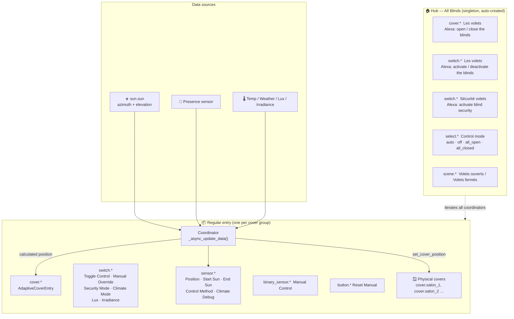
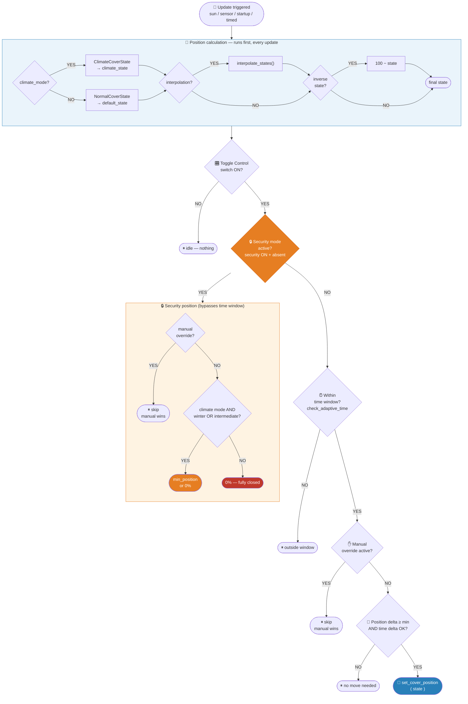
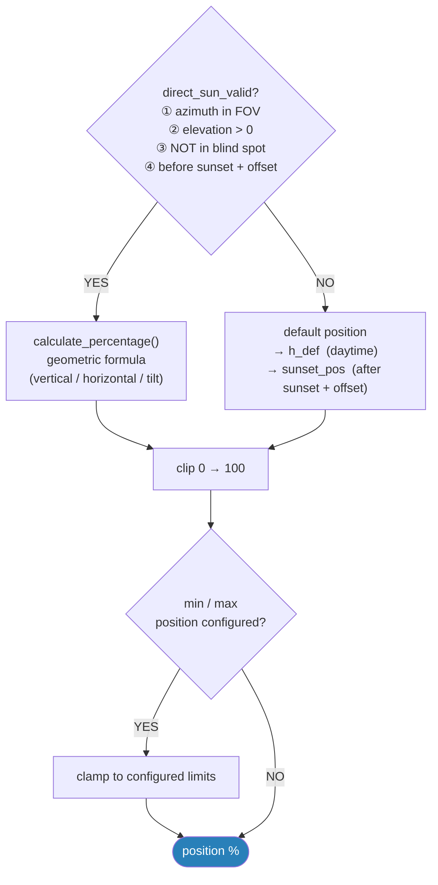
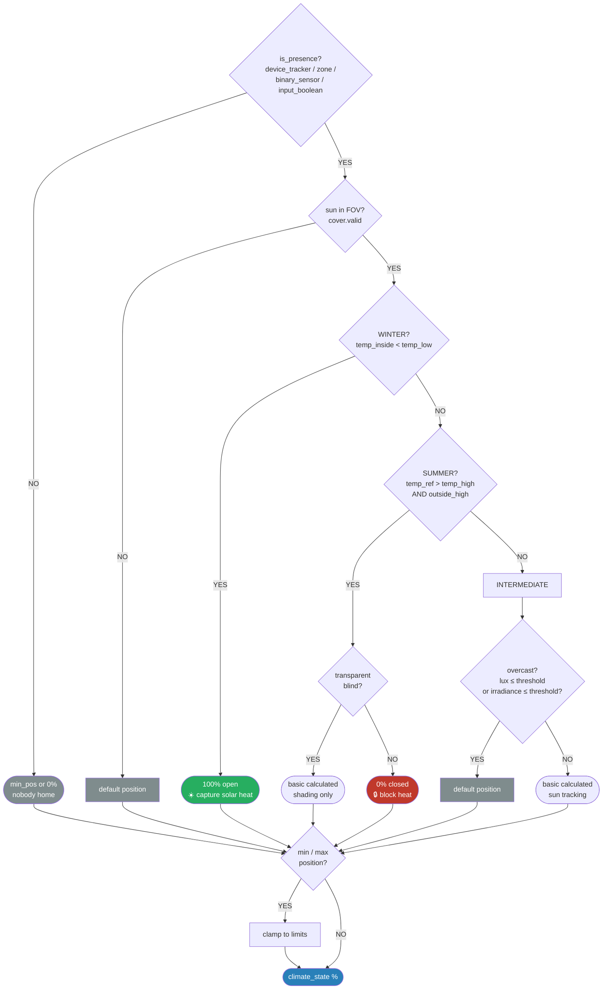

# Adaptive Cover

🇫🇷 [Documentation en français](README.fr.md)

[](CHANGELOG.md)
[](https://www.home-assistant.io)
[](LICENSE)

Automatically position your covers (blinds, awnings, tilts) based on the sun's position.

---

## Modes

This component supports **three** strategy modes:

| Mode | Activation | Priority | Description |
|------|-----------|----------|-------------|
| `basic` | Always active | 3 (base) | Pure sun-position tracking |
| `climate` | `switch.climate_mode` ON | 2 | Adapts to temperature — summer / winter / intermediate branches |
| `security` | `switch.security_mode` ON + absence | **1 (highest)** | Closes covers when nobody is home — overrides all other logic |

> **Security > Climate > Basic** — security always wins when active.

---

## Architecture



---

## Control flow — per cover, per update

Every sun/sensor state change triggers a coordinator refresh. For each physical cover:



> **Timed refresh** (sunset): same security check, then applies `sunset_pos` directly — no manual/delta checks.
>
> **Cover state change**: does not set position; detects manual moves and marks the cover as `manual_controlled`.

---

## Position calculation — detail

### Normal / Basic mode



### Climate mode



---

## Cover types

| Type | Description |
|------|-------------|
| **Vertical blind** (`cover_blind`) | Roller blind — position in % (0 = open, 100 = closed) |
| **Horizontal awning** (`cover_awning`) | Outdoor awning projected horizontally |
| **Tilt** (`cover_tilt`) | Venetian blind with adjustable slat angle |

---

## Installation

### HACS (recommended)

1. In HACS → **Integrations → Custom repositories**
2. Add `https://github.com/kamahat/adaptive-cover` (category: Integration)
3. Search for *Adaptive Cover* and install
4. Restart Home Assistant

### Manual

1. Copy `adaptive_cover` into `config/custom_components/`
2. Restart Home Assistant

---

## Configuration

Add via **Settings → Devices & Services → Add integration → Adaptive Cover**.

### Basic (required)

| Option | Description |
|--------|-------------|
| **Name** | Label for this cover group |
| **Cover type** | Vertical / Horizontal / Tilt |
| **Azimuth** | Window direction in degrees (0 = N, 90 = E, 180 = S, 270 = W) |
| **Field of view left / right** | Degrees from window normal where sun hits the glass |
| **Window height** | Height in metres |
| **Distance shaded area** | Depth to keep in shade (metres) |
| **Default position** | Fallback position (%) when sun is outside FOV |

### Cover group

| Option | Description |
|--------|-------------|
| **Covers** | `cover.*` entities controlled by this entry |

### Time window

| Option | Description |
|--------|-------------|
| **Start / end time or entity** | Adaptive control window |
| **Sunrise / sunset offset** | Shift in minutes |
| **Sunset position** | Position applied at sunset |
| **Return at sunset** | Restore default instead of sunset position |

### Position limits

| Option | Description |
|--------|-------------|
| **Min position** | Minimum allowed (%) — also used by security mode in winter/intermediate |
| **Max position** | Maximum allowed (%) |

### Blind spot

| Option | Description |
|--------|-------------|
| **Enable blind spot** | Activate |
| **Blind spot left / right** | Azimuth range (°) defining the blind spot |
| **Blind spot elevation** | Minimum sun elevation (°) for blind spot to apply |

### Tilt-specific

| Option | Description |
|--------|-------------|
| **Slat depth** | Physical depth of one slat (mm) |
| **Slat distance** | Gap between slats (mm) |
| **Tilt mode** | `mode1` — single direction 0°–90°; `mode2` — bi-directional 0°–180° |

### Climate mode

Enable via **Settings → [entry] → Configure → Climate settings**.

| Option | Description |
|--------|-------------|
| **Temperature entity** | Indoor sensor |
| **Outside temperature entity** | Outdoor sensor (optional) |
| **Weather entity** | Temperature source when no sensor |
| **Temp low / high** | Winter / summer thresholds (°C) |
| **Use outside temperature** | Compare outside temp to `temp_high` |
| **Weather condition** | States considered "sunny" |
| **Presence entity** | Used for both **climate mode** and **security mode** |

### Security mode

> Requires a **presence entity** to be configured. Without one, the switch is inactive even when ON.

| Situation | Target position |
|---|---|
| No climate mode | 0 % (fully closed) |
| Climate mode + `summer` branch | 0 % (fully closed) |
| Climate mode + `winter` or `intermediate` | `CONF_MIN_POSITION` (or 0 if unset) |

- Manual override wins — covers in manual control are skipped
- Automatic return — when presence is restored, adaptive positioning resumes
- Fail-safe — unavailable presence sensor → security inactive

### Light threshold

| Option | Description |
|--------|-------------|
| **Lux entity / threshold** | Below threshold → treated as "not sunny" in intermediate branch |
| **Irradiance entity / threshold** | Same for irradiance |

### Manual override

| Option | Description |
|--------|-------------|
| **Duration** | Minutes to pause adaptive control after a manual move |
| **Reset time** | Time of day to auto-reset |
| **Threshold** | Position delta (%) that counts as "manual" |
| **Ignore intermediate** | Only fully open/closed moves count |

---

## Entities

### "All Blinds" hub device

| Entity | Name | Alexa | Description |
|--------|------|-------|-------------|
| `cover.*` | Les volets | "open / close the blinds" | Aggregate cover — all entries |
| `switch.*` | Les volets | "activate / deactivate the blinds" | Adaptive control ON/OFF |
| `switch.*` | Sécurité volets | "activate blind security" | Security mode — entries with presence entity |
| `select.*` | Control mode | — | `auto` · `off` · `all_open` · `all_closed` |
| `scene.*_all_open` | Volets ouverts | "turn on Volets ouverts" | All to 100 % |
| `scene.*_all_closed` | Volets fermés | "turn on Volets fermés" | All to 0 % |

### Regular entry device

| Entity | Default | Description |
|--------|---------|-------------|
| `cover.<name>` | — | Main entity — adaptive position; open/close/set_position on this group |
| `switch.toggle_control_<name>` | ON | Enable / disable adaptive positioning |
| `switch.manual_override_<name>` | ON | Pause adaptive control (auto-set on manual move) |
| `switch.security_mode_<name>` | **OFF** | Security mode *(visible when presence entity configured)* |
| `switch.climate_mode_<name>` | ON | Toggle climate mode *(visible when configured)* |
| `switch.outside_temperature_<name>` | OFF | Use outside temp for summer detection |
| `switch.lux_<name>` | ON | Enable lux threshold |
| `switch.irradiance_<name>` | ON | Enable irradiance threshold |
| `sensor.cover_position_<name>` | — | Calculated target position (%) |
| `sensor.start_sun_<name>` / `end_sun` | — | Timestamps when sun enters/leaves FOV |
| `sensor.control_method_<name>` | — | Active branch: `summer` / `winter` / `intermediate` |
| `sensor.climate_debug_<name>` *(diag.)* | — | Full snapshot of climate decision inputs |
| `binary_sensor.manual_control_<name>` | — | ON when any cover is in manual override |
| `button.reset_manual_control_<name>` | — | Immediately clear manual override |

---

## Alexa integration

| Command | Entity | Action |
|---------|--------|--------|
| "open the blinds" | `cover.*` hub | → 100 % |
| "close the blinds" | `cover.*` hub | → 0 % |
| "activate the blinds" | `switch.*` adaptive hub | Adaptive ON |
| "deactivate the blinds" | `switch.*` adaptive hub | Adaptive OFF |
| "activate blind security" | `switch.*` security hub | Security ON |
| "deactivate blind security" | `switch.*` security hub | Security OFF |
| "turn on Volets ouverts" | `scene.*_all_open` | All to 100 % |
| "turn on Volets fermés" | `scene.*_all_closed` | All to 0 % |

---

## Automation examples

### Activate security on departure

```yaml
automation:
  - alias: "Security mode on departure"
    trigger:
      - platform: state
        entity_id: binary_sensor.presence_home
        to: "off"
        for: "00:05:00"
    action:
      - service: switch.turn_on
        target:
          entity_id: switch.security_mode_salon
```

### Evening close via select

```yaml
automation:
  - alias: "Close all blinds in the evening"
    trigger:
      - platform: time
        at: "21:00:00"
    action:
      - service: select.select_option
        target:
          entity_id: select.control_mode
        data:
          option: all_closed
```

---

## Troubleshooting

| Symptom | Likely cause | Fix |
|---------|-------------|-----|
| Cover doesn't move | `switch.toggle_control` is OFF | Turn the switch ON |
| Cover stuck in manual | Manual override active | Press reset button or wait |
| Cover stays closed after returning home | Security switch ON + presence unavailable | Check presence sensor |
| Security switch not visible | No presence entity configured | Add `presence_entity` in entry options |
| Climate branch always "intermediate" | No temperature entity | Add a temperature sensor |
| Duplicate cover entity | Legacy v1.7.x residue | Auto-fixed on startup (v1.8.11+) |

---

## Links

- [Changelog](CHANGELOG.md)
- [Operational Runbook (FR)](RUNBOOK.fr.md)
- [Releases](https://github.com/kamahat/adaptive-cover/releases)
- [Issues](https://github.com/kamahat/adaptive-cover/issues)
